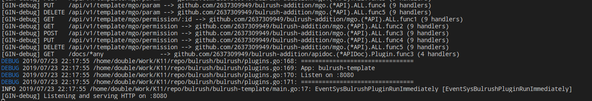
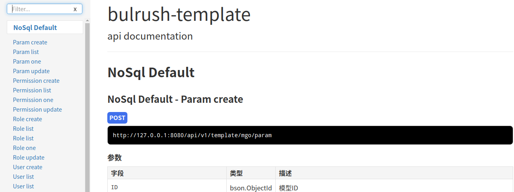

## Directory

<!-- TOC -->

- [Directory](#directory)
- [bulrush-addition](#bulrush-addition)
    - [mgo addition](#mgo-addition)
        - [Create mgoext](#create-mgoext)
        - [Use as a bulrush plugin](#use-as-a-bulrush-plugin)
        - [Defined model and custom your own config if you need](#defined-model-and-custom-your-own-config-if-you-need)
        - [Defined your config](#defined-your-config)
            - [Global](#global)
            - [Profile](#profile)
            - [Code](#code)
    - [gorm addition](#gorm-addition)
        - [Create gormext](#create-gormext)
        - [Use as a bulrush plugin](#use-as-a-bulrush-plugin-1)
        - [Defined model and custom your own config if you need](#defined-model-and-custom-your-own-config-if-you-need-1)
        - [Defined your config](#defined-your-config-1)
            - [Global](#global-1)
            - [Profile](#profile-1)
            - [Code](#code-1)
        - [SQL translation](#sql-translation)
    - [Logger](#logger)
        - [Add Transport](#add-transport)
    - [Redis](#redis)
    - [Apidoc](#apidoc)
        - [Install apidoc](#install-apidoc)
        - [Add ignore to .igonre file](#add-ignore-to-igonre-file)
        - [Generate apidoc](#generate-apidoc)
        - [Use apidoc plugin](#use-apidoc-plugin)
- [MIT License](#mit-license)

<!-- /TOC -->

## bulrush-addition
	Provides the ability to expose default interfaces based on database-driven wrappers

### mgo addition

#### Create mgoext
```go
var MGOExt = mgoext.New(conf.Cfg)
```

#### Use as a bulrush plugin
```go
app.PostUse(addition.MGOExt)
```

#### Defined model and custom your own config if you need
```go
type User struct {
	Base     `bson:",inline"`
	Name     string          `bson:"name" form:"name" json:"name" xml:"name"`
	Password string          `bson:"password" form:"password" json:"password" xml:"password" `
	Age      int             `bson:"age" form:"age" json:"age" xml:"age"`
	Roles    []bson.ObjectId `ref:"role" bson:"roles" form:"roles" json:"roles" xml:"roles" `
}

var _ = addition.MGOExt.Register(&mgoext.Profile{
	DB:        "test",
	Name:      "user",
	Reflector: &User{},
	BanHook:   true,     // all hook never to added to router, should by hand
})

// RegisterUser inject function
func RegisterUser(r *gin.RouterGroup) {
	addition.MGOExt.API.List(r, "user").Pre(func(c *gin.Context) {
		addition.Logger.Info("before")
	}).Post(func(c *gin.Context) {
		addition.Logger.Info("after")
	}).Auth(func(c *gin.Context) bool {
		return true
	})
	addition.MGOExt.API.Feature("feature").List(r, "user")
	addition.MGOExt.API.One(r, "user")
	addition.MGOExt.API.Create(r, "user")
	addition.MGOExt.API.Update(r, "user")
	addition.MGOExt.API.Delete(r, "user")
}
```
#### Defined your config
	Configure the priority levels
		Global < Profile < Code
##### Global
```go
var MGOExt = mgoext.
New().
Init(func(ext *mgoext.Mongo) {
	cfg := &mgo.DialInfo{}
	if err := conf.Conf.Unmarshal("mongo", cfg); err != nil {
		panic(err)
	}
	ext.Conf(cfg)
	ext.API.Opts.Prefix = "/template/mgo"
	ext.API.Opts.RouteHooks = &mgoext.RouteHooks{
		List: &mgoext.ListHook{
			Pre: func(c *gin.Context) {
				Logger.Info("all mgo before")
			},
		},
	}
})
```

##### Profile
```go
var _ = addition.MGOExt.Register(&mgoext.Profile{
	Name:      "User",
	Reflector: &User{},
	BanHook:   true,
	Opts: &mgoext.Opts{
		RouteHooks: &mgoext.RouteHooks{
			List: &mgoext.ListHook{
				Pre: func(c *gin.Context) {
					addition.Logger.Info("user before")
				},
			},
		},
	},
}).Init(func(ext *mgoext.Mongo) {
	Model := addition.MGOExt.Model("User")
	for _, key := range []string{"name"} {
		index := mgo.Index{
			Key:    []string{key},
			Unique: true,
		}
		if err := Model.EnsureIndex(index); err != nil {
			addition.Logger.Error(err.Error())
		}
	}
})
```

##### Code
```go
func RegisterUser(r *gin.RouterGroup, role *role.Role) {
	addition.MGOExt.API.List(r, "User").Pre(func(c *gin.Context) {
		addition.Logger.Info("after")
	}).Auth(func(c *gin.Context) bool {
		return true
	})
	addition.MGOExt.API.Feature("feature").List(r, "User")
	addition.MGOExt.API.One(r, "User", role.Can("r1,r2@p1,p3,p4;r4"))
	addition.MGOExt.API.Create(r, "User")
	addition.MGOExt.API.Update(r, "User")
	addition.MGOExt.API.Delete(r, "User")
}
```

### gorm addition

#### Create gormext
```go
var GORMExt = gormext.New(gormConf)
var _ = GORMExt.Init(func(ext *gormext.GORM) {
	ext.DB.Set("gorm:table_options", "ENGINE=InnoDB CHARSET=utf8mb4")
	ext.API.Opts.Prefix = "/template/gorm"
	ext.API.Opts.RouteHooks = &gormext.RouteHooks{
		List: &gormext.ListHook{
			Pre: func(c *gin.Context) {
				Logger.Info("all gormext before")
			},
		},
	}
})
```
#### Use as a bulrush plugin
```go
app.PostUse(addition.GORMExt)
```

```go
type User struct {
	Base
	Name string `form:"name" json:"name" xml:"name"`
	Age  uint   `form:"age" json:"age" xml:"age"`
}

var _ = addition.GORMExt.Register(&gormext.Profile{
	DB:        "test",
	Name:      "user",
	Reflector: &User{},
	BanHook:   true,
})
```

#### Defined model and custom your own config if you need
```go
// RegisterUser inject function
func RegisterUser(r *gin.RouterGroup) {
	addition.GORMExt.API.List(r, "user").Pre(func(c *gin.Context) {
		addition.Logger.Info("before")
	}).Post(func(c *gin.Context) {
		addition.Logger.Info("after")
	}).Auth(func(c *gin.Context) bool {
		return true
	})
	addition.GORMExt.API.Feature("subUser").List(r, "user")
	addition.GORMExt.API.One(r, "user")
	addition.GORMExt.API.Create(r, "user")
	addition.GORMExt.API.Update(r, "user")
	addition.GORMExt.API.Delete(r, "user")
}
```

#### Defined your config
	Configure the priority levels
		Global < Profile < Code
##### Global
```go
var GORMExt = gormext.
New().
Init(func(ext *gormext.GORM) {
	cfg := &gormext.Config{}
	if err := conf.Conf.Unmarshal("sql", cfg); err != nil {
		panic(err)
	}
	ext.Conf(cfg)
	// 建议在数据库创建时指定CHARSET, 这里设置后看gorm log并不起效
	ext.DB.Set("gorm:table_options", "ENGINE=InnoDB CHARSET=utf8")
	ext.DB.LogMode(true)
	ext.API.Opts.Prefix = "/template/gorm"
	ext.API.Opts.RouteHooks = &gormext.RouteHooks{
		// only list creator data
		List: &gormext.ListHook{
			Cond: func(cond map[string]interface{},
				c *gin.Context,
				info struct{ Name string }) map[string]interface{} {
				iden, _ := c.Get("identify")
				if iden != nil {
					token := iden.(*identify.Token)
					cond["CreatorID"] = token.Extra.(map[string]interface{})["ID"]
				}
				return cond
			},
		},
		// only list creator data
		One: &gormext.OneHook{
			Cond: func(cond map[string]interface{},
				c *gin.Context,
				info struct{ Name string }) map[string]interface{} {
				iden, _ := c.Get("identify")
				if iden != nil {
					token := iden.(*identify.Token)
					cond["CreatorID"] = token.Extra.(map[string]interface{})["ID"]
				}
				return cond
			},
		},
		// only update creator data
		Update: &gormext.UpdateHook{
			Cond: func(cond map[string]interface{},
				c *gin.Context,
				info struct{ Name string }) map[string]interface{} {
				iden, _ := c.Get("identify")
				if iden != nil {
					token := iden.(*identify.Token)
					cond["CreatorID"] = token.Extra.(map[string]interface{})["ID"]
				}
				return cond
			},
		},
		// only delete creator data
		Delete: &gormext.DeleteHook{
			Cond: func(cond map[string]interface{},
				c *gin.Context,
				info struct{ Name string }) map[string]interface{} {
				iden, _ := c.Get("identify")
				if iden != nil {
					token := iden.(*identify.Token)
					cond["CreatorID"] = token.Extra.(map[string]interface{})["ID"]
				}
				return cond
			},
		},
	}
})
```

##### Profile
```go
var _ = addition.GORMExt.Register(&gormext.Profile{
	Name:      "User",
	Reflector: &User{},
	BanHook:   true,
	Opts: &gormext.Opts{
		RouteHooks: &gormext.RouteHooks{
			List: &gormext.ListHook{
				Pre: func(c *gin.Context) {
					addition.Logger.Info("User model pre hook")
				},
			},
		},
	},
})
```

##### Code
```go
addition.GORMExt.API.List(r, "User").Post(func(c *gin.Context) {
	addition.Logger.Info("after")
}).Auth(func(c *gin.Context) bool {
	return true
}).RouteHooks(&gormext.RouteHooks{
	// Override global config, never query only by own
	List: &gormext.ListHook{
		Cond: func(cond map[string]interface{},
			c *gin.Context,
			info struct{ Name string }) map[string]interface{} {
			return cond
		},
	},
})
```

#### SQL translation

| 指令 | 是否安全 | Example | SQL |
| ------ | ------ | ------ | ------ |
| $eq | 是 |  { "$or": [ { "ID": 117 }, { "Name": "测试2" } ] } | ((((id = 117 and deleted_at is  null) or (name = '测试2' and deleted_at is  null)))) |
| $ne | 是 |  { "$or": [ { "ID": 117 }, { "Name": "测试2" } ] } | ((((id = 117 and deleted_at is  null) or (name = '测试2' and deleted_at is  null)))) |
| $gte | 是 |  { "$or": [ { "ID": 117 }, { "Name": "测试2" } ] } | ((((id = 117 and deleted_at is  null) or (name = '测试2' and deleted_at is  null)))) |
| $gt | 是 |  { "$or": [ { "ID": 117 }, { "Name": "测试2" } ] } | ((((id = 117 and deleted_at is  null) or (name = '测试2' and deleted_at is  null)))) |
| $lte | 是 |  { "$or": [ { "ID": 117 }, { "Name": "测试2" } ] } | ((((id = 117 and deleted_at is  null) or (name = '测试2' and deleted_at is  null)))) |
| $in | 是 |  { "$or": [ { "ID": 117 }, { "Name": "测试2" } ] } | ((((id = 117 and deleted_at is  null) or (name = '测试2' and deleted_at is  null)))) |
| $regex | 是 |  { "$or": [ { "ID": 117 }, { "Name": "测试2" } ] } | ((((id = 117 and deleted_at is  null) or (name = '测试2' and deleted_at is  null)))) |
| $like | 是 |  { "$or": [ { "ID": 117 }, { "Name": "测试2" } ] } | ((((id = 117 and deleted_at is  null) or (name = '测试2' and deleted_at is  null)))) |
| $exists | 是 |  { "$or": [ { "ID": 117 }, { "Name": "测试2" } ] } | ((((id = 117 and deleted_at is  null) or (name = '测试2' and deleted_at is  null)))) |


### Logger

#### Add Transport
```
var Logger = addition.RushLogger.
	AppendTransports(
		&logger.Transport{
			Dirname: path.Join(path.Join(".", conf.Cfg.Log.Path), "error"),
			Level:   logger.ERROR,
			Maxsize: logger.Maxsize,
		},
		&logger.Transport{
			Dirname: path.Join(path.Join(".", conf.Cfg.Log.Path), "combined"),
			Level:   logger.SILLY,
			Maxsize: logger.Maxsize,
		},
	).
	Init(func(j *logger.Journal) {
		j.SetFlags((logger.LstdFlags | logger.Llongfile))
	})
```



### Redis
```go
redis := redis.New(conf.Cfg)
rules := []limit.Rule{
	limit.Rule{
		Methods: []string{"GET"},
		Match:   "/api/v1/user*",
		Rate:    1,
	},
	limit.Rule{
		Methods: []string{"GET"},
		Match:   "/api/v1/role*",
		Rate:    2,
	},
}
app.Use(&limit.Limit{
	Frequency: &limit.Frequency{
		Passages: []string{},
		Rules: rules,
		Model: &limit.RedisModel{
			Redis: redis,
		},
	},
})
```

### Apidoc

#### Install apidoc
```shell
npm install apidoc -g
```
#### Add ignore to .igonre file
```txt
/doc/*
!/doc/api_data.js
!/doc/api_project.js
```
#### Generate apidoc 
```shell
apidoc
```
	apidoc will generate doc dir and some files in doc dir

#### Use apidoc plugin

```so
// APIDoc defined http rest api
// APIDoc defined http rest api
var APIDoc = apidoc.New()
var _ = APIDoc.
	Config(path.Join("", "doc")).
	Init(func(ctx *apidoc.APIDoc) {
		ctx.Prefix = "/docs"
	})
app.Use(APIDoc)
```


## MIT License

Copyright (c) 2018-2020 Double

Permission is hereby granted, free of charge, to any person obtaining a copy
of this software and associated documentation files (the "Software"), to deal
in the Software without restriction, including without limitation the rights
to use, copy, modify, merge, publish, distribute, sublicense, and/or sell
copies of the Software, and to permit persons to whom the Software is
furnished to do so, subject to the following conditions:

The above copyright notice and this permission notice shall be included in all
copies or substantial portions of the Software.

THE SOFTWARE IS PROVIDED "AS IS", WITHOUT WARRANTY OF ANY KIND, EXPRESS OR
IMPLIED, INCLUDING BUT NOT LIMITED TO THE WARRANTIES OF MERCHANTABILITY,
FITNESS FOR A PARTICULAR PURPOSE AND NONINFRINGEMENT. IN NO EVENT SHALL THE
AUTHORS OR COPYRIGHT HOLDERS BE LIABLE FOR ANY CLAIM, DAMAGES OR OTHER
LIABILITY, WHETHER IN AN ACTION OF CONTRACT, TORT OR OTHERWISE, ARISING FROM,
OUT OF OR IN CONNECTION WITH THE SOFTWARE OR THE USE OR OTHER DEALINGS IN THE
SOFTWARE.